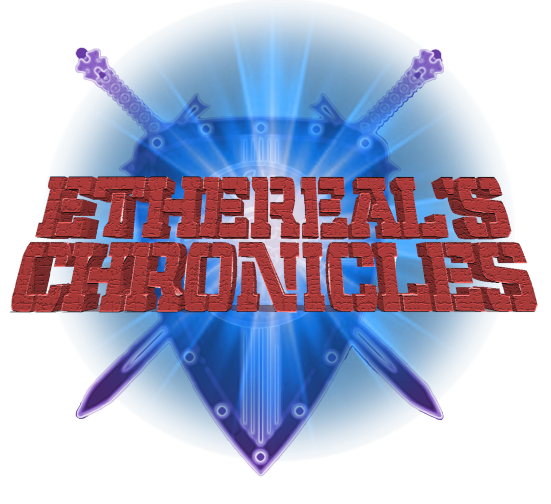

# Ethereal's Chronicles dApp

  

Hello, we are the Guzmán brothers. We believe that games must be fun!. We are developing a dApp, a new decentralized game called Ethereal's Chronicles. We are using Binance Smart Chain as our Blockchain to engage and reward our users for playing with our tokens (Kopernik token). In Ethereal's world almost everything is a crypto-collectible.

Basically is a highly interactive multiplayer fighting style game. You can create new characters with awesome and unique characteristics burned and saved into BSC and use them to fight other's players characters. Every character is unique, special and very valuable!

This project was generated with [Angular CLI](https://github.com/angular/angular-cli) version 11.1.2.

## DEMO
You can play our first stable demo here: [https://bafzbeidekq3xo74yjxycvaa5asbiwoyevrc7timckvwym4caea52zjbmum.textile.space/](https://bafzbeidekq3xo74yjxycvaa5asbiwoyevrc7timckvwym4caea52zjbmum.textile.space/)

## DEMO VIDEO
Watch our demo video here: https://www.youtube.com/watch?v=vXsJ3irwx7Y

## HOW TO PLAY?
Go to the dApp website and click the "START" button, choose your wallet and register yourself as a player. Remember: You are going to need BNB (from testnet) in order to play!

## HOW TO CONFIGURE METAMASK?
Please follow the instructions on the next link to connect your Metamask with Binance Smart Chain. [Connect Your MetaMask With Binance Smart Chain](https://docs.binance.org/smart-chain/wallet/metamask.html#connect-your-metamask-with-binance-smart-chain)

## FREE BINANCE TOKENS FOR TESTNET
Get FREE TESTNET BNB from the Binance faucet and start playing for FREE. [Binance Faucet](https://testnet.binance.org/faucet-smart)

## Deployed Contracts (Last update: 2021-02-17)
EtherealGame: 0xB775ae662C2Ba38eC533317ba776F97daebD6D71
KopernikToken: 0x8A1C5607D5e0bAdf8929EDbbB80906164100778B
EtherealPlanet: 0x62AC806a90977B5799F9622Ad04842A01c339Bc6
EtherealWeapon: 0x1A9080f7e0b9F09042a40eA8616cA4939Fe8E767
EtherealCharacter: 0x95FA15DDef966463c8C42279695232F5df6a73A3

## Development server

Run `ng serve` for a dev server. Navigate to `http://localhost:4200/`. The app will automatically reload if you change any of the source files.

## Code scaffolding

Run `ng generate component component-name` to generate a new component. You can also use `ng generate directive|pipe|service|class|guard|interface|enum|module`.

## How to clone and install source code?

Run `npm install` after clonning the project to download all the required libraries.

## Build

Run `ng build` to build the project. The build artifacts will be stored in the `dist/` directory. Use the `--prod` flag for a production build.

## Running unit tests

Run `ng test` to execute the unit tests via [Karma](https://karma-runner.github.io).

## Running end-to-end tests

Run `ng e2e` to execute the end-to-end tests via [Protractor](http://www.protractortest.org/).

## Troubleshooting

If you don't have installed Angular cli then you can try running this dapp using the node package manager: npm run ng serve

## About Ethereal's Game
We create our own images for Ethereal's Game. All characters were made by the ukrainian artist Ihor Khoynyak, one of the most talented artists in the world!

Also the characters and the game were in turn based on the histories written by Miguel Guzmán. Coding made by Ricardo Guzmán. Thank God that finally we made this project happen.

## Contact

This project is still in beta stage, please reach us if you need some help about the game or if you find any bug to the email: criptoalfacoaching@gmail.com

## Further help

To get more help on the Angular CLI use `ng help` or go check out the [Angular CLI Overview and Command Reference](https://angular.io/cli) page.
